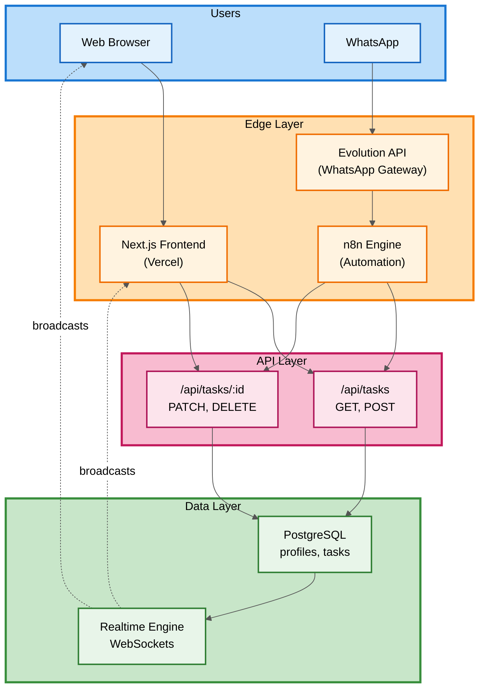
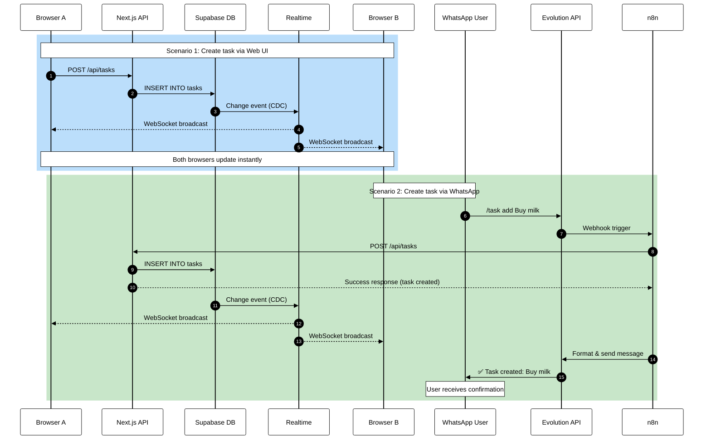

# 📝 TaskFlow

A modern, real-time task management application built with Next.js 15, Supabase, and N8N integration.

## ✨ Features

- ✅ **CRUD Operations** - Create, read, update, delete tasks
- 🔄 **Real-time Updates** - Auto-sync across all devices using Supabase Realtime
- 📱 **WhatsApp Integration** - Manage tasks via WhatsApp (N8N + Evolituon API)
- 🎨 **Modern UI** - Clean, responsive design with Tailwind CSS
- 🔐 **Secure API** - Protected webhook endpoints
- 📊 **Task Statistics** - Track pending/completed tasks
- 🎯 **Filters** - View all, pending, or completed tasks
- 💾 **Persistent Storage** - PostgreSQL via Supabase

## 🛠️ Tech Stack

- **Frontend:** Next.js 15 (App Router), React 19, TypeScript
- **Styling:** Tailwind CSS
- **Database:** Supabase (PostgreSQL)
- **Real-time:** Supabase Realtime (WebSockets)
- **API:** Next.js API Routes
- **Automation:** N8N
- **Chatbot:** WhatsApp Business API (Evolution API)
- **Deployment:** Vercel

## 🏗️ System Architecture

### High-Level Overview

### Data Flow Logic

#### 🔄 Real-time Sync Flow

 ##📂 Project Structure
 
bash
taskflow/
├── app/
│   ├── api/
│   │   ├── tasks/
│   │   │   ├── route.ts          # GET/POST /api/tasks
│   │   │   └── [id]/route.ts     # PATCH/DELETE /api/tasks/:id
│   │   ├── link/
│   │   │   └── route.ts          # Generate link codes for account linking
│   │   ├── whatsapp/
│   │   │   ├── webhook/route.ts  # WhatsApp inbound webhook (Evolution → N8N/TaskFlow)
│   │   │   └── link/route.ts     # Handle WhatsApp link confirmation
│   │   ├── profiles/route.ts     # Profile bootstrap / retrieval
│   │   └── sessions/route.ts     # Chat sessions (WhatsApp context)
│   ├── dashboard/
│   │   ├── DashboardClient.tsx   # Client wrapper for dashboard
│   │   └── page.tsx              # Dashboard page (server)
│   ├── layout.tsx                # Root layout
│   ├── page.tsx                  # Landing / redirect to dashboard
│   └── globals.css               # Global styles
├── components/
│   ├── DashboardContent.tsx      # Main dashboard UI and logic
│   ├── TaskForm.tsx              # Create/edit task form
│   ├── TaskList.tsx              # List wrapper with filters
│   ├── TaskItem.tsx              # Single task item (toggle, delete)
│   └── ConfirmModal.tsx          # Reusable confirm modal
├── lib/
│   ├── supabase.ts               # Supabase client/helper
│   ├── ai.ts                     # Reserved for AI helpers
│   └── types.ts                  # Shared types
├── supabase/
│   └── schema.sql                # Database schema
├── workflows/
│   ├── Description_Enrich.json   # N8N AI enrichment workflow
│   └── Task_Manager_Whatsapp.json# N8N WhatsApp workflow
├── README.md
├── package.json
├── tsconfig.json
├── tailwind.config.ts
└── postcss.config.js
🗄️ Database Model (Supabase)
Defined in supabase/schema.sql.
​

###Tables
profiles

id uuid primary key default extensions.uuid_generate_v4()

email text unique

name text

phone text unique

is_guest boolean default true

link_code text unique

created_via text default 'web'

Indexed by phone, link_code, is_guest.​

tasks

id uuid primary key default extensions.uuid_generate_v4()

user_id text not null

title text not null

description text

is_completed boolean default false

created_at timestamptz default now()

updated_at timestamptz default now()

Indexes: is_completed, created_at desc, user_id.

Trigger tasks_updated_at to maintain updated_at.​

chat_sessions

id uuid primary key default gen_random_uuid()

user_phone text unique not null

is_active boolean default true

created_at timestamptz default now()

last_interaction timestamptz default now()

context jsonb default '{}'::jsonb

Indexes on user_phone, is_active.​

🚀 Getting Started
Prerequisites
Node.js and npm.

Supabase project with SQL functions and uuid-ossp/pgcrypto enabled (for uuid_generate_v4 and gen_random_uuid).​

Optional: N8N instance and Evolution API account for WhatsApp integration.
​

1. Clone and install
bash
git clone <your-repo-url>.git
cd taskflow
npm install
2. Configure Supabase
In the Supabase SQL editor, run supabase/schema.sql.​

Ensure the update_updated_at() trigger function exists or create it before running the tasks_updated_at trigger.​

3. Environment variables
Create a .env.local file (see your .env.example if present) with at least:

bash
NEXT_PUBLIC_SUPABASE_URL=...
NEXT_PUBLIC_SUPABASE_ANON_KEY=...
SUPABASE_SERVICE_ROLE_KEY=...

# Optional – used by N8N/Evolution and AI
EVOLUTION_API_BASE_URL=...
EVOLUTION_API_INSTANCE_ID=...
EVOLUTION_API_TOKEN=...
OPENAI_API_KEY=...
These keys are used by the Supabase client and by external automation (N8N).
​

4. Run the app
bash
npm run dev
The app will be available at http://localhost:3000.

The dashboard is served at /dashboard and will bootstrap a profile for the current user if needed.

📡 REST API
GET /api/tasks
List all tasks for a given user.​

Query: userId (required) – the user identifier (tasks.user_id).​

Example:

bash
curl "https://your-app.com/api/tasks?userId=USER_ID"
Response (200):

json
{
  "success": true,
  "data": [
    {
      "id": "uuid",
      "user_id": "USER_ID",
      "title": "Task title",
      "description": "Optional description",
      "is_completed": false,
      "created_at": "...",
      "updated_at": "..."
    }
  ]
}
POST /api/tasks
Create a new task.​

Body:

json
{
  "userId": "USER_ID",
  "title": "Task title",
  "description": "Optional description"
}
Also accepts legacy user_id in the body; userId takes precedence.​

PATCH /api/tasks/:id
Update an existing task (title, description, or completion status).

Body supports userId and status fields (is_completed, isCompleted, or iscompleted).

Example body:

json
{
  "userId": "USER_ID",
  "is_completed": true,
  "title": "Updated title"
}
DELETE /api/tasks/:id
Delete a task.

Validates userId via query or body (depending on your implementation in route.ts).

📱 WhatsApp Linking & Automation
Dashboard linking UI
The dashboard shows a dedicated WhatsApp linking section:​

Explains that you can control TaskFlow from your phone and unlink at any time.

Provides a two‑step flow:

Activate TaskFlow: send a specific activation message to the WhatsApp bot.

Link your account: send the generated link code to connect your phone to your web account.​

When linking is in progress, the UI shows a “Waiting for WhatsApp link...” state until the backend confirms the link.​

Backend endpoints
Dedicated API routes handle:

Link generation – create a link_code for the current profile so the phone can be attached.

WhatsApp webhook – receive inbound messages, map them to a chat_session, and forward to N8N/automation as needed.

Session management – store/update chat_sessions.context and last_interaction based on user messages.​

🤖 N8N Workflows
1. Description_Enrich
A reusable workflow triggered by other workflows (e.g., Task_Manager_Whatsapp) to enrich task descriptions using AI.​

Trigger: When Executed by Another Workflow.

Extracts taskId, title, userId from the incoming payload (prepare_enrich_payload).​

Calls an AI Agent (OpenAI gpt-4.1-mini) with a structured prompt to:

Write a concise description.

Optionally add a 3–5 item checklist.

Never mention AI.​

Normalizes agent output and calls:

text
PATCH /api/tasks/{{ taskId }}?userId={{ userId }}
to update the description.​

2. Task_Manager_Whatsapp
Full WhatsApp workflow to manage tasks through commands and natural language.​

High‑level behavior

Webhook receives messages from Evolution API with message, from, senderName, etc.

Resolves or creates profiles/chat_sessions based on phone number.
​

Detects whether the input is:

/task ... or #to-do-list type command.

A free‑form sentence interpreted with AI.​

Calls /api/tasks (GET/POST/PATCH/DELETE) to manage tasks.
​

Optionally calls Description_Enrich after creating a task.
​

Formats human‑friendly replies and sends them back via Evolution API.​

🧪 Development Notes
Types: shared types for tasks and API responses are defined in types.ts.

Styling: Tailwind config and globals.css define the main design system (colors, fonts, layout).

Client logic: the main dashboard logic (filters, stats, modals, linking state) lives in DashboardContent.tsx and DashboardClient.tsx.​

📄 License
This project can be licensed under MIT (or the license chosen by your organization).
Make sure to add a LICENSE file in the repository root if it is not already present.
