# 📝 TaskFlow

A modern, real-time task management application built with Next.js 15, Supabase, and N8N integration.


## ✨ Features

- ✅ **CRUD Operations** - Create, read, update, delete tasks
- 🔄 **Real-time Updates** - Auto-sync across all devices using Supabase Realtime
- 📱 **WhatsApp Integration** - Manage tasks via WhatsApp (N8N + Evolituon API)
- 🎨 **Modern UI** - Clean, responsive design with Tailwind CSS
- 🔐 **Secure API** - Protected webhook endpoints
- 📊 **Task Statistics** - Track pending/completed tasks
- 🎯 **Filters** - View all, pending, or completed tasks
- 💾 **Persistent Storage** - PostgreSQL via Supabase

## 🛠️ Tech Stack

- **Frontend:** Next.js 15 (App Router), React 19, TypeScript
- **Styling:** Tailwind CSS
- **Database:** Supabase (PostgreSQL)
- **Real-time:** Supabase Realtime (WebSockets)
- **API:** Next.js API Routes
- **Automation:** N8N
- **Chatbot:** WhatsApp Business API (Evolution API)
- **Deployment:** Vercel

## 🏗️ System Architecture

### High-Level Overview

```mermaid
%%{init: {'theme':'base', 'themeVariables': { 'primaryColor':'#bbdefb','primaryTextColor':'#000','primaryBorderColor':'#1976d2','lineColor':'#555','secondaryColor':'#ffe0b2','tertiaryColor':'#f8bbd0','clusterBkg':'#bbdefb','clusterBorder':'#1976d2','titleColor':'#000','edgeLabelBackground':'#fff'}}}%%
graph TB
    subgraph USERS["👥 Users"]
        WB["🌐 Web Browser"]
        WA["📱 WhatsApp"]
    end

    subgraph EDGE["⚡ Edge Layer"]
        FE["Next.js Frontend<br/>(Vercel)"]
        EVO["Evolution API<br/>(WhatsApp Gateway)"]
        N8N["n8n Engine<br/>(Automation)"]
    end

    subgraph API["🔌 API Layer"]
        TASKS["/api/tasks<br/>GET, POST"]
        TASKID["/api/tasks/:id<br/>PATCH, DELETE"]
        LINK["/api/link<br/>Account Linking"]
    end

    subgraph DATA["💾 Data Layer"]
        DB["PostgreSQL<br/>profiles, tasks, sessions"]
        RT["Realtime Engine<br/>WebSockets"]
    end

    WB --> FE
    FE --> TASKS
    FE --> TASKID
    FE --> LINK

    WA --> EVO
    EVO --> N8N
    N8N --> TASKS
    N8N --> TASKID

    TASKS --> DB
    TASKID --> DB
    LINK --> DB
    N8N --> TASKID

    DB --> RT
    RT -.->|broadcasts| FE
    RT -.->|broadcasts| WB

    style USERS fill:#bbdefb,stroke:#1976d2,stroke-width:3px
    style EDGE fill:#ffe0b2,stroke:#f57c00,stroke-width:3px
    style API fill:#f8bbd0,stroke:#c2185b,stroke-width:3px
    style DATA fill:#c8e6c9,stroke:#388e3c,stroke-width:3px
```



### Data Flow Logic

#### 🔄 Real-time Sync Flow

```mermaid
%%{init: {'theme':'base', 'themeVariables': { 'primaryColor':'#fff','primaryTextColor':'#000','primaryBorderColor':'#000','lineColor':'#000','secondaryColor':'#fff','tertiaryColor':'#fff','noteTextColor':'#000','noteBkgColor':'#fff','noteBorderColor':'#000'}}}%%
sequenceDiagram
    autonumber
    participant WEB as Browser A
    participant API as Next.js API
    participant DB as Supabase DB
    participant RT as Realtime
    participant WEB2 as Browser B
    participant WA as WhatsApp User
    participant EVO as Evolution API
    participant N8N as n8n
    
    rect rgb(187, 222, 251)
        Note over WEB,WEB2: Scenario 1: Create task via Web UI
        WEB->>API: POST /api/tasks
        API->>DB: INSERT INTO tasks
        DB->>RT: Change event (CDC)
        RT-->>WEB: WebSocket broadcast
        RT-->>WEB2: WebSocket broadcast
        Note over WEB,WEB2: Both browsers update instantly
    end

    rect rgb(200, 230, 201)
        Note over WA,WEB2: Scenario 2: Create task via WhatsApp
        WA->>EVO: "create task buy milk"
        EVO->>N8N: Webhook trigger
        N8N->>API: POST /api/tasks
        API->>DB: INSERT INTO tasks
        API-->>N8N: Success response
        DB->>RT: Change event (CDC)
        RT-->>WEB: WebSocket broadcast
        RT-->>WEB2: WebSocket broadcast
        N8N->>EVO: Format & send message
        EVO->>WA: ✅ Task created: Buy milk
        Note over WA: User receives confirmation
    end
```



 ## 📂 Project Structure
 ```
taskflow/
├── app/
│   ├── api/
│   │   ├── tasks/
│   │   │   ├── route.ts              # GET/POST /api/tasks
│   │   │   └── [id]/route.ts         # PATCH/DELETE /api/tasks/:id
│   │   ├── link/
│   │   │   └── route.ts              # Generate link codes
│   │   ├── whatsapp/
│   │   │   ├── webhook/route.ts      # WhatsApp inbound webhook
│   │   │   └── link/route.ts         # WhatsApp link confirmation
│   │   ├── profiles/route.ts         # Profile management
│   │   └── sessions/route.ts         # Chat sessions
│   ├── dashboard/
│   │   ├── DashboardClient.tsx       # Client wrapper
│   │   └── page.tsx                  # Dashboard page (server)
│   ├── layout.tsx                    # Root layout
│   ├── page.tsx                      # Landing page
│   └── globals.css                   # Global styles
├── components/
│   ├── DashboardContent.tsx          # Main dashboard UI
│   ├── TaskForm.tsx                  # Task form
│   ├── TaskList.tsx                  # Task list with filters
│   ├── TaskItem.tsx                  # Single task component
│   └── ConfirmModal.tsx              # Confirmation modal
├── lib/
│   ├── supabase.ts                   # Supabase client
│   ├── ai.ts                         # AI helpers
│   └── types.ts                      # Shared TypeScript types
├── supabase/
│   └── schema.sql                    # Database schema
├── workflows/
│   ├── Description_Enrich.json       # N8N AI enrichment
│   └── Task_Manager_Whatsapp.json    # N8N WhatsApp workflow
├── .env.example
├── README.md
├── package.json
├── tsconfig.json
├── tailwind.config.ts
└── postcss.config.js​
```
🗄️ Database Schema
Defined in supabase/schema.sql

Tables
profiles
Stores user information and account linking data.

```sql
CREATE TABLE public.profiles (
  id UUID PRIMARY KEY DEFAULT extensions.uuid_generate_v4(),
  email TEXT UNIQUE,
  name TEXT,
  phone TEXT UNIQUE,
  is_guest BOOLEAN DEFAULT true,
  link_code TEXT UNIQUE,
  created_via TEXT DEFAULT 'web',
  created_at TIMESTAMPTZ DEFAULT now()
);


-- Indexes

CREATE INDEX idx_profiles_phone ON profiles(phone) WHERE phone IS NOT NULL;
CREATE INDEX idx_profiles_link_code ON profiles(link_code) WHERE link_code IS NOT NULL;
CREATE INDEX idx_profiles_is_guest ON profiles(is_guest);
```
Fields:

id – Unique user identifier

email – User email (optional, unique)

name – User display name

phone – WhatsApp phone number (unique)

is_guest – Guest account flag

link_code – Short code for WhatsApp linking

created_via – Registration source (web or whatsapp)

tasks
Stores all user tasks.

```sql
CREATE TABLE public.tasks (
  id UUID PRIMARY KEY DEFAULT extensions.uuid_generate_v4(),
  user_id TEXT NOT NULL,
  title TEXT NOT NULL,
  description TEXT,
  is_completed BOOLEAN DEFAULT false,
  created_at TIMESTAMPTZ DEFAULT now(),
  updated_at TIMESTAMPTZ DEFAULT now()
);
-- Indexes
CREATE INDEX idx_tasks_user_id ON tasks(user_id);
CREATE INDEX idx_tasks_completed ON tasks(is_completed);
CREATE INDEX idx_tasks_created_at ON tasks(created_at DESC);

-- Trigger to auto-update updated_at
CREATE TRIGGER tasks_updated_at
  BEFORE UPDATE ON tasks
  FOR EACH ROW
  EXECUTE FUNCTION update_updated_at();
```

Fields:

id – Task unique identifier

user_id – Owner identifier (from profiles.id)

title – Task title (required)

description – Task description (optional, AI-generated)

is_completed – Completion status

created_at – Creation timestamp

updated_at – Last modification timestamp

chat_sessions
Stores WhatsApp conversation context.

```sql
CREATE TABLE public.chat_sessions (
  id UUID PRIMARY KEY DEFAULT gen_random_uuid(),
  user_phone TEXT UNIQUE NOT NULL,
  is_active BOOLEAN DEFAULT true,
  created_at TIMESTAMPTZ DEFAULT now(),
  last_interaction TIMESTAMPTZ DEFAULT now(),
  context JSONB DEFAULT '{}'::jsonb
);

-- Indexes
CREATE INDEX idx_chat_sessions_phone ON chat_sessions(user_phone);
CREATE INDEX idx_chat_sessions_active ON chat_sessions(is_active);
```
Fields:

id – Session identifier

user_phone – WhatsApp phone number

is_active – Session active flag

created_at – Session start timestamp

last_interaction – Last message timestamp

context – Conversation state (JSON)

🚀 Getting Started
Prerequisites
Node.js 18+ and npm

Supabase project with uuid-ossp and pgcrypto extensions enabled

(Optional) N8N instance for WhatsApp integration

(Optional) Evolution API account for WhatsApp

(Optional) OpenAI API key for AI features

1. Clone the repository
```bash
git clone https://github.com/your-username/taskflow.git
cd taskflow
npm install
```

2. Configure Supabase
Create a new Supabase project at supabase.com

In the SQL Editor, run the contents of supabase/schema.sql

Ensure the update_updated_at() function exists:

```sql
CREATE OR REPLACE FUNCTION update_updated_at()
RETURNS TRIGGER AS $$
BEGIN
  NEW.updated_at = now();
  RETURN NEW;
END;
$$ LANGUAGE plpgsql;
3. Environment variables
Create a .env.local file in the root directory:
```
```bash
# Supabase
NEXT_PUBLIC_SUPABASE_URL=https://your-project.supabase.co
NEXT_PUBLIC_SUPABASE_ANON_KEY=your-anon-key
SUPABASE_SERVICE_ROLE_KEY=your-service-role-key

# Evolution API (Optional - for WhatsApp)
EVOLUTION_API_BASE_URL=https://your-evolution-instance.com
EVOLUTION_API_INSTANCE_ID=your-instance-id
EVOLUTION_API_TOKEN=your-api-token

# OpenAI (Optional - for AI features)
OPENAI_API_KEY=sk-your-openai-key
```

4. Run the development server
```bash
npm run dev
The app will be available at http://localhost:3000
```
5. Deploy to Vercel
```bash
npm install -g vercel
vercel
Follow the prompts and add your environment variables in the Vercel dashboard.
```
📡 REST API Reference

Base URL```
https://your-app.vercel.app/api```
Endpoints```
GET /api/tasks```
Retrieve all tasks for a user.

Query Parameters:

userId (required) – User identifier

Example:

```bash
curl "https://your-app.com/api/tasks?userId=26e90e24-cdc8-4c35-a6c2-8cce46140ee1"
Response (200):

json
{
  "success": true,
  "data": [
    {
      "id": "c290cbca-bc2e-4421-ba33-6e434bf96d7d",
      "user_id": "26e90e24-cdc8-4c35-a6c2-8cce46140ee1",
      "title": "Buy groceries",
      "description": "Get milk, eggs, and bread from the store.",
      "is_completed": false,
      "created_at": "2025-12-19T18:14:56.118638+00:00",
      "updated_at": "2025-12-19T18:14:56.118638+00:00"
    }
  ]
}
```

POST /api/tasks
Create a new task.
```
Request Body:

json
{
  "userId": "26e90e24-cdc8-4c35-a6c2-8cce46140ee1",
  "title": "Buy groceries",
  "description": "Get milk, eggs, and bread"
}
Example:

bash
curl -X POST https://your-app.com/api/tasks \
  -H "Content-Type: application/json" \
  -d '{
    "userId": "26e90e24-cdc8-4c35-a6c2-8cce46140ee1",
    "title": "Buy groceries"
  }'
Response (201):

json
{
  "success": true,
  "data": {
    "id": "c290cbca-bc2e-4421-ba33-6e434bf96d7d",
    "user_id": "26e90e24-cdc8-4c35-a6c2-8cce46140ee1",
    "title": "Buy groceries",
    "description": null,
    "is_completed": false,
    "created_at": "2025-12-19T18:14:56.118638+00:00",
    "updated_at": "2025-12-19T18:14:56.118638+00:00"
  }
}
```
PATCH /api/tasks/:id
Update an existing task.
```
Request Body:

json
{
  "userId": "26e90e24-cdc8-4c35-a6c2-8cce46140ee1",
  "is_completed": true,
  "title": "Buy groceries (updated)"
}
Example:

bash
curl -X PATCH https://your-app.com/api/tasks/c290cbca-bc2e-4421-ba33-6e434bf96d7d \
  -H "Content-Type: application/json" \
  -d '{
    "userId": "26e90e24-cdc8-4c35-a6c2-8cce46140ee1",
    "is_completed": true
  }'
Response (200):

json
{
  "success": true,
  "data": {
    "id": "c290cbca-bc2e-4421-ba33-6e434bf96d7d",
    "is_completed": true,
    "updated_at": "2025-12-19T19:30:00.000000+00:00"
  }
}
```
DELETE /api/tasks/:id
Delete a task permanently.

Query Parameters:

userId (required) – User identifier for validation

Example:

```bash
curl -X DELETE "https://your-app.com/api/tasks/c290cbca-bc2e-4421-ba33-6e434bf96d7d?userId=26e90e24-cdc8-4c35-a6c2-8cce46140ee1"
Response (200):

json
{
  "success": true,
  "message": "Task deleted successfully"
}
```

📱 WhatsApp Integration
Account Linking
TaskFlow allows users to link their WhatsApp number to their web account.

Dashboard Linking Flow:

User clicks "Link WhatsApp" in the dashboard

System generates a unique 6-character link_code

User sends activation message to WhatsApp bot: #to-do-list

User sends the link_code to complete linking

Dashboard shows confirmation when link is successful

Backend Endpoints:
```
POST /api/link – Generate a new link code

POST /api/whatsapp/link – Validate and complete the link
```
WhatsApp Commands
Once linked, users can manage tasks via WhatsApp:

Structured Commands:
```
/task add Buy milk              → Create a new task
/task list                      → List all tasks
/task done <task-id>            → Mark task as completed
/task delete <task-id>          → Delete a task

Natural Language:

"create a task to buy milk tomorrow"
"show me my tasks"
"mark the milk task as done"
"delete the groceries task"
The N8N workflow uses AI to interpret natural language and map it to the appropriate API calls.
```

🤖 N8N Workflows
TaskFlow includes two main N8N workflows for automation.

1. Description_Enrich
Purpose: Automatically enrich task descriptions using AI

Trigger: Called by Task_Manager_Whatsapp workflow after task creation

Flow:

```graph LR
    A[Workflow Trigger] --> B[Prepare Payload]
    B --> C[AI Agent<br/>GPT-4.1-mini]
    C --> D[Merge Output]
    D --> E[Update Task API]
Configuration:

javascript
// Node: prepare_enrich_payload
const created = $json.data?.task || $json.data || $json;

return {
  taskId: created.id,
  title: created.title || '',
  userId: created.user_id || $json.userId || null,
};
javascript
// Node: merge_enriched
const base = $node['prepare_enrich_payload'].json;
const ai = $json;

let description = ai.output || ai.text || '';

if (typeof description === 'string' && description.startsWith('{')) {
  try {
    const parsed = JSON.parse(description);
    description = parsed.description || parsed.text || description;
  } catch (e) {
    // keep as is
  }
}

return {
  taskId: base.taskId,
  userId: base.userId,
  description: description.trim(),
};
```

AI Prompt:
```
You are an assistant that writes helpful task descriptions for a personal task manager. Write a concise, clear description of the task. Optionally add a short checklist with 3–5 bullet points. Keep everything under 120 words. Use simple, direct language. Do not mention that the text was generated by AI.
```
2. Task_Manager_Whatsapp
Purpose: Full WhatsApp integration for task management

Trigger: Webhook from Evolution API

High-level Flow:
```
Webhook Receive – Evolution API forwards WhatsApp messages

User Resolution – Map phone number to userId (or create profile)

Intent Detection – Determine if command or natural language

Task API Calls – Execute CRUD operations

AI Enrichment – Optionally call Description_Enrich

Response Formatting – Build user-friendly message

Send to WhatsApp – Return response via Evolution API
```

Import Instructions:

Open N8N dashboard

Click Import from file

Select workflows/Task_Manager_Whatsapp.json

Update credentials:

OpenAI API key

Evolution API credentials

TaskFlow base URL

Activate workflow

🧪 Development
Tech Stack Details
Frontend:

Next.js 15 App Router for server/client components

TypeScript for type safety

Tailwind CSS for styling

React 19 for UI components

Backend:

Next.js API Routes for REST endpoints

Supabase client for database operations

Realtime subscriptions for live updates

Database:

PostgreSQL via Supabase

Row-level security (optional)

Triggers for updated_at maintenance

Key Files
Types:

```typescript
// types.ts
export interface Task {
  id: string;
  user_id: string;
  title: string;
  description: string | null;
  is_completed: boolean;
  created_at: string;
  updated_at: string;
}

export interface Profile {
  id: string;
  email: string | null;
  name: string | null;
  phone: string | null;
  is_guest: boolean;
  link_code: string | null;
  created_via: string;
  created_at: string;
}
Supabase Client:

typescript
// lib/supabase.ts
import { createClient } from '@supabase/supabase-js';

export const supabase = createClient(
  process.env.NEXT_PUBLIC_SUPABASE_URL!,
  process.env.NEXT_PUBLIC_SUPABASE_ANON_KEY!
);
Scripts
bash
npm run dev          # Start development server
npm run build        # Build for production
npm run start        # Start production server
npm run lint         # Run ESLint
```

🎨 UI Components
Dashboard
The main dashboard (DashboardContent.tsx) includes:

Task Statistics – Real-time counters for pending/completed tasks

Task Creation Form – Quick add with title and optional description

Task List – Filterable list with real-time updates

WhatsApp Linking Panel – Account connection interface

Task Items – Individual task cards with toggle and delete actions

Components
TaskForm.tsx

Controlled form for creating tasks

Validates title (required)

Supports optional description

TaskList.tsx

Renders filtered task list

Handles empty states

Manages loading states

TaskItem.tsx

Individual task display

Toggle completion with optimistic updates

Delete with confirmation modal

ConfirmModal.tsx

Reusable confirmation dialog

Used for destructive actions

🔒 Security
User-scoped queries ensure data isolation

API routes validate userId on all operations

Supabase Row Level Security (RLS) can be enabled for additional protection

Environment variables keep sensitive credentials secure

CORS configured for production domain only

🚢 Deployment
Vercel (Recommended)
Push your code to GitHub

Import project in Vercel

Add environment variables

Deploy

Manual Deployment
bash
npm run build
npm run start
Environment Variables (Production)
Ensure all variables from .env.local are configured in your hosting provider's environment settings.

📄 License
This project is licensed under the MIT License - see the LICENSE file for details.