# 📝 TaskFlow

A modern, real-time task management application built with Next.js 15, Supabase, and N8N integration.


## ✨ Features

- ✅ **CRUD Operations** - Create, read, update, delete tasks
- 🔄 **Real-time Updates** - Auto-sync across all devices using Supabase Realtime
- 📱 **WhatsApp Integration** - Manage tasks via WhatsApp (N8N + Evolituon API)
- 🎨 **Modern UI** - Clean, responsive design with Tailwind CSS
- 🔐 **Secure API** - Protected webhook endpoints
- 📊 **Task Statistics** - Track pending/completed tasks
- 🎯 **Filters** - View all, pending, or completed tasks
- 💾 **Persistent Storage** - PostgreSQL via Supabase

## 🛠️ Tech Stack

- **Frontend:** Next.js 15 (App Router), React 19, TypeScript
- **Styling:** Tailwind CSS
- **Database:** Supabase (PostgreSQL)
- **Real-time:** Supabase Realtime (WebSockets)
- **API:** Next.js API Routes
- **Automation:** N8N
- **Chatbot:** WhatsApp Business API (Evolution API)
- **Deployment:** Vercel

## 🏗️ System Architecture

### High-Level Overview


### Data Flow Logic

#### 🔄 Real-time Sync Flow

```mermaid
%%{init: {'theme':'base', 'themeVariables': { 'primaryColor':'#fff','primaryTextColor':'#000','primaryBorderColor':'#000','lineColor':'#000','secondaryColor':'#fff','tertiaryColor':'#fff','noteTextColor':'#000','noteBkgColor':'#fff','noteBorderColor':'#000'}}}%%
sequenceDiagram
    autonumber
    participant WEB as Browser A
    participant API as Next.js API
    participant DB as Supabase DB
    participant RT as Realtime
    participant WEB2 as Browser B
    participant WA as WhatsApp User
    participant EVO as Evolution API
    participant N8N as n8n
    
    rect rgb(187, 222, 251)
        Note over WEB,WEB2: Scenario 1: Create task via Web UI
        WEB->>API: POST /api/tasks
        API->>DB: INSERT INTO tasks
        DB->>RT: Change event (CDC)
        RT-->>WEB: WebSocket broadcast
        RT-->>WEB2: WebSocket broadcast
        Note over WEB,WEB2: Both browsers update instantly
    end

    rect rgb(200, 230, 201)
        Note over WA,WEB2: Scenario 2: Create task via WhatsApp
        WA->>EVO: /task add Buy milk
        EVO->>N8N: Webhook trigger
        N8N->>API: POST /api/tasks
        API->>DB: INSERT INTO tasks
        API-->>N8N: Success response (task created)
        DB->>RT: Change event (CDC)
        RT-->>WEB: WebSocket broadcast
        RT-->>WEB2: WebSocket broadcast
        N8N->>EVO: Format & send message
        EVO->>WA: ✅ Task created: Buy milk
        Note over WA: User receives confirmation
    end
```



## 📦 Project Structure

```
taskflow/
├── app/
│   ├── api/
│   │   └── tasks/
│   │       ├── route.ts
│   │       └── [id]/
│   │           └── route.ts
│   ├── dashboard/
│   │   └── page.tsx
│   ├── globals.css
│   ├── layout.tsx
│   └── page.tsx
├── components/
│   ├── ConfirmModal.tsx
│   ├── DashboardContent.tsx
│   ├── TaskForm.tsx
│   ├── TaskItem.tsx
│   └── TaskList.tsx
├── lib/
│   ├── ai.ts
│   ├── schemas.ts
│   └── supabase.ts
├── supabase/
│   └── schema.sql
├── types.ts
├── .env.example
├── .env.local
├── .gitignore
├── next-env.d.ts
├── next.config.js
├── package-lock.json
├── package.json
├── postcss.config.js
├── README.md
├── tailwind.config.ts
├── tsconfig.json
```

## 🚀 Getting Started

### 1. Clone Repository
```bash
git clone https://github.com/yourusername/taskflow.git
cd taskflow
npm install
```
### 2. Supabase Setup

Run the following SQL in your Supabase **SQL Editor**:
```sql
-- 1. Enable UUID extension
CREATE EXTENSION IF NOT EXISTS "uuid-ossp";

-- 2. Profiles table
CREATE TABLE profiles (
id UUID PRIMARY KEY DEFAULT uuid_generate_v4(),
email TEXT UNIQUE NOT NULL,
name TEXT,
created_at TIMESTAMP DEFAULT NOW()
);

-- 3. Tasks table
CREATE TABLE tasks (
id UUID PRIMARY KEY DEFAULT uuid_generate_v4(),
user_id UUID REFERENCES profiles(id) ON DELETE CASCADE NOT NULL,
title TEXT NOT NULL,
description TEXT,
is_completed BOOLEAN DEFAULT FALSE,
created_at TIMESTAMP DEFAULT NOW(),
updated_at TIMESTAMP DEFAULT NOW()
);

-- 4. Indexes
CREATE INDEX idx_tasks_user_id ON tasks(user_id);
CREATE INDEX idx_tasks_completed ON tasks(is_completed);

-- 5. Auto-update timestamp Function
CREATE OR REPLACE FUNCTION update_updated_at()
RETURNS TRIGGER AS $$
BEGIN
NEW.updated_at = NOW();
RETURN NEW;
END;

-- 6. Trigger
```sql
CREATE TRIGGER tasks_updated_at
BEFORE UPDATE ON tasks
FOR EACH ROW EXECUTE FUNCTION update_updated_at();

-- 7. Enable Realtime
```sql
ALTER TABLE tasks REPLICA IDENTITY FULL;
ALTER PUBLICATION supabase_realtime ADD TABLE tasks;

-- 8. Create Demo User

INSERT INTO profiles (email, name)
VALUES ('demo@taskflow.com', 'Demo User')
ON CONFLICT (email) DO NOTHING
RETURNING id, email;
```

> **⚠️ Important:** Copy the `id` (UUID) returned from step 8! You'll need it below.

### 3. Environment Variables

Create `.env.local` in your project root:

Supabase Configuration
```bash
NEXT_PUBLIC_SUPABASE_URL=https://your-project.supabase.co
NEXT_PUBLIC_SUPABASE_ANON_KEY=eyJhbGciOiJIUzI1NiIsInR5...
SUPABASE_SERVICE_ROLE_KEY=eyJhbGciOiJIUzI1NiIsInR5...
```

### 4. Configuration

Update `app/dashboard/page.tsx`:
```bash
const USER_ID = 'paste-your-uuid-here';
```
### 5. Run
```bash
npm run dev
```
## 📡 REST API Documentation

### Endpoints

#### GET /api/tasks
List all tasks for a user

**Query Parameters:**
- `user_id` (required): UUID of the user

**Example:**
```
curl "https://your-app.vercel.app/api/tasks?user_id=YOUR_USER_ID"
```
**Response:**
```
{
"success": true,
"data": [
{
"id": "uuid",
"user_id": "uuid",
"title": "Task title",
"description": "Optional description",
"is_completed": false,
"created_at": "2025-12-17T...",
"updated_at": "2025-12-17T..."
}
]
}
```
#### POST /api/tasks
Create a new task

**Body:**
```
{
"user_id": "uuid",
"title": "Task title",
"description": "Optional description"
}
```
**Example:**
```
curl -X POST https://your-app.vercel.app/api/tasks
-H "Content-Type: application/json"
-d '{"user_id":"YOUR_USER_ID","title":"Buy milk"}'
```
#### PATCH /api/tasks/:id
Update a task (mark as completed, change title, etc)

**Body:**
```
{
"is_completed": true,
"title": "Updated title"
}
```
**Example:**
```
curl -X PATCH https://your-app.vercel.app/api/tasks/TASK_ID
-H "Content-Type: application/json"
-d '{"is_completed":true}'
```
#### DELETE /api/tasks/:id
Delete a task permanently

**Example:**
```
curl -X DELETE https://your-app.vercel.app/api/tasks/TASK_ID
```
## 🤖 N8N Integration Guide

### Workflow Logic
`[Webhook] → [Parse Command] → [Call TaskFlow API] → [Format Response] → [Send WhatsApp]`

### Node 2: Function (Parse Command)
```markdown
// Parse WhatsApp message
const message = $input.item.json.body.message || '';
const phone = $input.item.json.body.from || '';
const senderName = $input.item.json.body.senderName || 'User';

// Parse: /task <action> <text>
const parts = message.trim().split(' ');
const command = parts?.toLowerCase();​
const taskText = parts.slice(2).join(' ');

// Your user ID (in production, map phone → user)
const userId = 'YOUR_USER_ID_HERE'; // Replace with your UUID

return {
command, // add, list, done, delete
taskText, // task title or task ID
userId,
phone,
senderName
};
```
### Node 3: Switch (Route by Command)
```markdown
Configure a Switch node with these rules:

Rule	Condition	Output
0	{{ $json.command }} equals add	Create Task
1	{{ $json.command }} equals list	List Tasks
2	{{ $json.command }} equals done	Complete Task
3	{{ $json.command }} equals delete	Delete Task
Fallback	(default)	Help Message
```

Node 4a: HTTP Request (Create Task)
Method: POST
```
URL: https://your-app.vercel.app/api/tasks

Body:

{
  "user_id": "={{ $json.userId }}",
  "title": "={{ $json.taskText }}"
}
```
Node 4b: HTTP Request (List Tasks)
Method: GET
```
URL: https://your-app.vercel.app/api/tasks?user_id={{ $json.userId }}
```
Node 4c: HTTP Request (Complete Task)
Method: PATCH
```
URL: https://your-app.vercel.app/api/tasks/{{ $json.taskText }}

Body:
{
  "is_completed": true
}
```
Node 4d: HTTP Request (Delete Task)
Method: DELETE
```
URL: https://your-app.vercel.app/api/tasks/{{ $json.taskText }}
```

Node 5: Function (Format Response)
```
const response = $input.item.json;
const phone = $input.first().json.phone;
const command = $input.first().json.command;

let message = '';

if (!command || command === 'help') {
  message = `*TaskFlow Commands:*\n\n`;
  message += `📝 /task add [title] - Create\n`;
  message += `📋 /task list - View all\n`;
  message += `✅ /task done [id] - Complete\n`;
  message += `🗑️ /task delete [id] - Delete`;
} else if (command === 'list' && response.success) {
  const tasks = response.data || [];
  message = `📋 *Tasks (${tasks.length})*\n\n`;
  tasks.forEach((t, i) => {
    message += `${i+1}. ${t.is_completed ? '✅' : '⏳'} ${t.title}\n`;
    message += `   ID: ${t.id.substring(0, 8)}\n\n`;
  });
} else if (command === 'add' && response.success) {
  message = `✅ *Task Created!*\n\n${response.data.title}`;
} else if (response.success) {
  message = `✅ ${command === 'done' ? 'Task completed!' : 'Task deleted!'}`;
} else {
  message = `❌ Error: ${response.error}`;
}

return { phone, message };
```
Node 6: HTTP Request (Send WhatsApp)
Method: POST
```
URL: https://evolution.yourdomain.com/message/sendText/YOUR_INSTANCE

Body:
{
  "number": "={{ $json.phone }}",
  "text": "={{ $json.message }}"
}
```

## 📡 REST API Documentation

### Endpoints

#### GET /api/tasks

List all tasks for a user.

**Query Parameters:**

- `userId` (required): UUID of the user (matches `profiles.id` in Supabase)

**Example:**

curl "https://your-app.vercel.app/api/tasks?userId=YOUR_USER_ID"


**Response:**

{
"success": true,
"data": [
{
"id": "uuid",
"user_id": "uuid",
"title": "Task title",
"description": "Optional description",
"is_completed": false,
"created_at": "2025-12-17T...",
"updated_at": "2025-12-17T..."
}
]
}

#### POST /api/tasks

Create a new task.

**Body:**

{
"userId": "uuid",
"title": "Task title",
"description": "Optional description"
}

> For backward compatibility, `{ "user_id": "uuid" }` is also accepted, but `userId` is preferred.

**Example:**

curl -X POST https://your-app.vercel.app/api/tasks
-H "Content-Type: application/json"
-d '{"userId":"YOUR_USER_ID","title":"Buy milk"}'


#### PATCH /api/tasks/:id

Update a task (mark as completed, change title, etc).

**Body:**

{
"userId": "uuid",
"is_completed": true,
"title": "Updated title"
}

> Also accepts `isCompleted` or `iscompleted` from legacy clients.

**Example:**

curl -X PATCH https://your-app.vercel.app/api/tasks/TASK_ID
-H "Content-Type: application/json"
-d '{"userId":"YOUR_USER_ID","is_completed":true}'


#### DELETE /api/tasks/:id

Delete a task permanently.

**Query Parameters:**

- `userId` (required): UUID of the user

**Example:**

curl -X DELETE "https://your-app.vercel.app/api/tasks/TASK_ID?userId=YOUR_USER_ID"

### WhatsApp Commands

Activate it on WhatsApp with the command:
#to-do-list

Once you activate it, you can interact in natural language chat the AI to create, delete or mark as completed, or rather choose the options numbers.

## 📄 License

MIT License - Copyright (c) 2025 TaskFlow